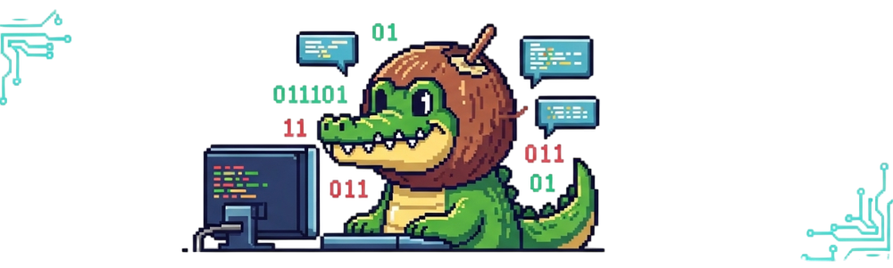
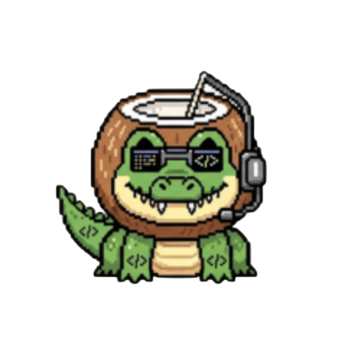

<!-- 
¡Hola, soy Daniel Huarachi!  
¡Bienvenido a mi perfil de GitHub! 
-->

<!-- Banner principal -->

  

<!-- Frase de presentación destacada -->
<h2 align="center">Desarrollador web y de videojuegos junior apasionado por la tecnología y la creatividad</h2>

<h1 align="center">¡Hola! 👋 Soy Daniel Huarachi</h1>

<!-- Presentación breve -->

  <b>👨‍💻 Técnico en formación</b> &nbsp;|&nbsp; <b>🚀 Aprendiz constante</b> &nbsp;|&nbsp; <b>💡 Apasionado por la programación</b>

  Soy un joven técnico en formación, apasionado por la <b>programación</b>, la <b>autodisciplina</b> y el <b>desarrollo personal</b>. 
  Me motiva <b>aprender cada día</b>, <b>crear proyectos</b>, <b>compartir mi progreso</b> y <b>ayudar</b> a quienes también recorren este camino de crecimiento.  
  ✨ Este perfil es el reflejo de mi proceso ✨ 
  Aquí encontrarás lo que <b>aprendo</b>, <b>creo</b> y <b>desarrollo</b>. 
  Documentaré mis avances, proyectos, ideas, herramientas y recursos útiles para mí y para quienes me siguen.  
  <b>👇 ¡Justo aquí abajo puedes acceder a mis redes, donde comparto más contenido, avances y experiencias! 👇</b>

<!-- Redes sociales -->

  
  
  
  

<!-- Imagen principal destacada -->

  

<!-- Secciones técnicas ordenadas y visualmente limpias -->

  <!-- Tecnologías principales -->
    

  <!-- Frameworks y librerías -->
  <h2 align="center">🟩 Frameworks y librerías</h2>
  

    
    
    
    
  

  <!-- Bases de datos y hosting -->
  <h2 align="center">💾 Bases de datos y hosting en la nube</h2>
  

    
    
    
    
  

  <!-- Motores de videojuegos -->
  <h2 align="center">🎮 Motores de videojuegos y desarrollo de juegos</h2>
  

    
    
  

  <!-- Herramientas -->
  <h2 align="center">🛠️ Herramientas</h2>
  

    
    
    
    
  

<!-- Stats y contador de visitas -->
<h2 align="center">📊 Stats & Analíticas</h2>

  
  

  

<!-- Avatar y mensaje final -->

  
  

  <b>¡Gracias por visitar mi perfil! 
  Si te interesa colaborar, compartir ideas o crees que puedo aportar a tu proyecto, no dudes en contactarme. 💬</b>

